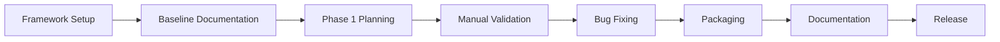

# 🚀 PROMPT CURSOR - RECREARE COMPLETĂ AI PROMPT GENERATOR ULTIMATE

## 📋 CONTEXT ȘI SITUAȚIE ACTUALĂ

### Status Real Proiect
**Implementare**: ~75% funcțional  
**Testare**: 111/111 teste PASSED (100%)  
**Coverage**: 76%  
**Bug-uri critice**: 0 (rezolvate)

**Ce funcționează:**
- ✅ Core modules (EventBus, Database, Context Engine, AI Orchestrator)
- ✅ 12 Quick Tasks implementate complet cu logică
- ✅ GUI funcțional (7 tabs: Dashboard, Prompt Generator, Monitoring, Settings, Backup, Incremental, Context)
- ✅ Backup/Restore system
- ✅ Incremental Workflow orchestration
- ✅ Change Detection system
- ✅ Testing suite comprehensive (pytest)

**Ce lipsește/trebuie refăcut:**
- ❌ **Structura fizică framework MODEL ÎMBUNĂTĂȚIT** (există doar documentație, nu foldere)
- ❌ **Sincronizare GitHub completă** (push-uri au eșuat din cauza fișierelor mari >100MB)
- ❌ **PyInstaller + NSIS packaging** complet funcțional
- ❌ **Testare manuală completă** a tuturor features
- ❌ **Documentație utilizator** finală
- ❌ **Release proces complet**

### Problema Critică Identificată
Din `cursor_verify_framework_creation_and_sy.md`:
- Framework-ul MODEL ÎMBUNĂTĂȚIT a fost creat doar ca **DOCUMENTAȚIE** (7800+ linii text)
- **Structura fizică de foldere NU există** pe disk
- Push-urile GitHub au eșuat din cauza fișierelor build (>100MB)
- Repository-ul a fost resetat la `origin/main`
- Trebuie **RECREAT proiectul** folosind framework-ul nou corect

---

## 🎯 OBIECTIV PRINCIPAL

**RECREARE COMPLETĂ** a proiectului AI Prompt Generator Ultimate folosind framework-ul **MODEL ÎMBUNĂTĂȚIT - Iterativ cu Validare v1.0**, cu:

1. **Structură fizică framework** creată pe disk
2. **Implementare incrementală** pas-cu-pas cu validare
3. **Testing comprehensiv** la fiecare etapă
4. **Sincronizare GitHub** corectă (fără fișiere mari)
5. **PyInstaller + NSIS** packaging production-ready
6. **Documentație completă** utilizator + dezvoltator
7. **Release v1.0.0** final cu toate artefactele

---

## 📐 ARHITECTURĂ FINALĂ CORECTĂ

### Stack Tehnologic Confirmat
```yaml
Language: Python 3.11+
GUI: PySide6 (Qt for Python) 6.6.0+
Database: SQLite (embedded, local)
File Monitoring: watchdog 4.0.0+
Context Parsing: Tree-sitter 0.20.4+
  - tree-sitter-python 0.20.4
  - tree-sitter-javascript 0.20.3
  - tree-sitter-typescript 0.20.3
  - tree-sitter-java 0.20.2
  - tree-sitter-go 0.20.0
Testing: pytest 8.0.0+ cu pytest-qt, pytest-cov
Packaging: PyInstaller 6.5.0+ + NSIS
AI Providers:
  - Claude (Anthropic): anthropic 0.34.0-0.40.0
  - OpenAI: openai 1.35.0-2.0.0
  - Gemini: google-generativeai 0.8.0-0.10.0
  - Perplexity: httpx 0.27.0-0.28.0
```

### Structură Proiect Finală
```
ai_prompt_generator_ultimate/
├── core/                          # Core business logic
│   ├── __init__.py
│   ├── event_bus.py              # ✅ Event system (91% coverage)
│   ├── database.py               # ✅ SQLite persistence (93% coverage)
│   ├── config_manager.py         # ✅ Configuration handling
│   ├── context_engine.py         # ✅ Tree-sitter parsing (87% coverage)
│   ├── ai_orchestrator.py        # ✅ Multi-AI coordination
│   ├── backup_manager.py         # ✅ Backup/restore system
│   ├── change_detector.py        # ✅ File changes detection (86% coverage)
│   ├── next_prompt_generator.py  # ✅ Next prompt generation (100% coverage)
│   └── incremental_workflow.py   # ✅ Workflow orchestration (98% coverage)
│
├── gui/                           # PySide6 interface
│   ├── __init__.py
│   ├── main_window.py            # ✅ Main application window
│   └── tabs/
│       ├── __init__.py
│       ├── dashboard_tab.py      # ✅ Overview & stats (100% coverage)
│       ├── prompt_generator_tab.py # ✅ Main prompt generation
│       ├── monitoring_tab.py     # ✅ Real-time monitoring (95% coverage)
│       ├── settings_tab.py       # ✅ Configuration (96% coverage)
│       ├── backup_tab.py         # ✅ Backup management
│       ├── incremental_tab.py    # ✅ Incremental workflow
│       └── context_tab.py        # ✅ Context visualization
│
├── tasks/                         # 12 Quick Tasks
│   ├── __init__.py
│   ├── analyze_code_quality.py   # ✅ Code quality analysis
│   ├── find_bugs.py              # ✅ Bug detection
│   ├── optimize_performance.py   # ✅ Performance optimization (89% coverage)
│   ├── security_audit.py         # ✅ Security scanning
│   ├── generate_tests.py         # ✅ Test generation (97% coverage)
│   ├── refactor_code.py          # ✅ Code refactoring (92% coverage)
│   ├── documentation_generator.py # ✅ Doc generation (93% coverage)
│   ├── architecture_review.py    # ✅ Architecture analysis (93% coverage)
│   ├── dependency_check.py       # ✅ Dependency analysis (88% coverage)
│   ├── migration_helper.py       # ✅ Migration assistance (93% coverage)
│   ├── code_style_fix.py         # ✅ Style fixes (92% coverage)
│   └── performance_profiling.py  # ✅ Performance profiling (100% coverage)
│
├── scripts/                       # Utility scripts
│   ├── extract_dna.py            # ✅ Project DNA extraction
│   └── setup_dev_env.py          # Development setup
│
├── tests/                         # Comprehensive test suite
│   ├── __init__.py
│   ├── test_event_bus.py         # ✅
│   ├── test_database.py          # ✅
│   ├── test_context_engine.py    # ✅
│   ├── test_ai_orchestrator.py   # ✅
│   ├── test_backup_manager.py    # ✅
│   ├── test_change_detector.py   # ✅
│   ├── test_next_prompt_generator.py # ✅
│   ├── test_incremental_workflow.py  # ✅
│   ├── test_*_task.py            # ✅ Pentru fiecare Quick Task
│   └── test_gui_integration.py   # ✅ GUI tests cu pytest-qt
│
├── docs/                          # Documentation
│   ├── README.md                 # Main documentation
│   ├── ARCHITECTURE.md           # Architecture overview
│   ├── API.md                    # API reference
│   ├── DEVELOPMENT.md            # Development guide
│   ├── USER_GUIDE.md             # User manual
│   └── TROUBLESHOOTING.md        # Common issues
│
├── Update_AI/                     # Output folder pentru generated files
│   ├── Ghid_Implementare_Proiect/ # ❌ FRAMEWORK STRUCTURE (TREBUIE CREAT!)
│   │   ├── 00_Overview/
│   │   │   └── MODEL_OVERVIEW.md
│   │   ├── 01_Planning/
│   │   │   └── PLANNING_GUIDE.md
│   │   ├── 02_Documentation/
│   │   │   └── DOCUMENTATION_STANDARDS.md
│   │   ├── 03_Implementation/
│   │   │   └── IMPLEMENTATION_GUIDE.md
│   │   ├── 04_Validation/
│   │   │   └── VALIDATION_CHECKLIST.md
│   │   ├── 05_Templates/
│   │   │   ├── PROJECT_TEMPLATE.md
│   │   │   ├── CHECKPOINT_TEMPLATE.md
│   │   │   └── RETROSPECTIVE_TEMPLATE.md
│   │   ├── 06_Retrospective/
│   │   │   └── (completat după finalizare)
│   │   └── README.md
│   │
│   ├── Backups/                  # Automatic backups
│   ├── Prompts/                  # Generated prompts
│   └── Reports/                  # Analysis reports
│
├── main.py                        # ✅ Application entry point
├── build_exe.py                   # ✅ PyInstaller build script
├── installer.nsi                  # ❌ NSIS installer script (TREBUIE COMPLETAT!)
├── requirements.txt               # ✅ Dependencies
├── pytest.ini                     # ✅ Pytest configuration
├── .gitignore                     # ✅ Git exclusions
├── LICENSE                        # ✅ MIT License
├── VERSION                        # Version info
└── README.md                      # ✅ Project documentation
```

---

## 🏗️ MODEL ÎMBUNĂTĂȚIT - Iterativ cu Validare v1.0

### Principii Fundamentale
1. **Plan & Validate**: Planifică, validează, ajustează (nu planifica și uită)
2. **Implement Incrementally**: Modul cu modul, cu testare între (nu "big bang")
3. **Test Continuously**: Testing integrat în development (nu testare finală)
4. **Document as You Go**: Documentare continuă, reflectă realitatea (nu docs la final)
5. **Iterate Based on Feedback**: Feedback loops, adaptare (nu waterfall strict)

### Reguli Critice
- ✅ **ZERO SIMULĂRI** - doar implementare reală
- ✅ **CHECKPOINTS OBLIGATORII** - validare după fiecare fază
- ✅ **DOCUMENTARE CONTINUĂ** - captează tot procesul
- ✅ **ONESTITATE TOTALĂ** - raportează real ce funcționează
- ✅ **INCREMENTALISM** - pas cu pas, nu big bang

### Cele 5 Faze

#### **FAZA 1: PLAN & VALIDATE** (4-8 ore)
```
1.1 Define Objectives (30-60 min)
    - Business goals
    - Technical goals
    - Success metrics
    - Out of scope

1.2 Requirements Gathering (1-2 ore)
    - Functional requirements (Must/Should/Nice to Have)
    - Non-functional requirements (performance, security, usability, scalability)
    - Technical constraints

1.3 Architecture Design (2-3 ore)
    - System components
    - Data flow
    - Tech stack confirmation
    - Integration points

1.4 Risk Analysis (30-60 min)
    - Technical risks
    - Timeline risks
    - Resource risks
    - Mitigation strategies

1.5 Create Development Plan (1-2 ore)
    - Milestones
    - Dependencies
    - Timeline estimates

✅ CHECKPOINT 1: "Can we start building this?"
   Questions:
   - Are objectives clear and agreed?
   - Are requirements complete enough?
   - Is architecture sound?
   - Are risks identified and mitigated?
   - Is plan realistic?
   
   Decision:
   - YES → Continue to Phase 2
   - NO → Fix issues, re-validate
   - UNSURE → Prototype first, then re-assess
```

#### **FAZA 2: DOCUMENT & REVIEW** (3-6 ore)
```
2.1 Technical Specification (2-3 ore)
    - Detailed architecture
    - Component specs
    - API contracts
    - Data models

2.2 Code Standards (30-60 min)
    - Naming conventions
    - Code structure
    - Error handling patterns
    - Logging patterns

2.3 Test Strategy (1-2 ore)
    - Test levels (unit, integration, system, acceptance)
    - Coverage targets (≥70%)
    - Test data strategy
    - CI/CD pipeline

2.4 Documentation Framework (30-60 min)
    - API documentation
    - User documentation
    - Developer documentation
    - Deployment documentation

✅ CHECKPOINT 2: "Is documentation clear & complete?"
   Questions:
   - Can a developer start coding from these specs?
   - Are all edge cases considered?
   - Is test strategy comprehensive?
   - Are standards clear and enforceable?
   
   Decision:
   - YES → Continue to Phase 3
   - NO → Improve documentation, re-review
   - GAPS → Fill them before coding
```

#### **FAZA 3: IMPLEMENT INCREMENTALLY** (variabil, estimat 60-80 ore pentru acest proiect)
```
PENTRU FIECARE MODUL:

3.1 Implement Core Functionality
    - Write code following standards
    - Add type hints
    - Add docstrings
    - Handle errors properly

3.2 Write Tests IMMEDIATELY
    - Unit tests
    - Integration tests
    - Edge cases
    - Error cases

3.3 Run Tests & Verify Coverage
    - pytest -v --cov=MODULE
    - Ensure coverage ≥70%
    - All tests must pass

3.4 Manual Validation
    - Test in real scenarios
    - Check edge cases
    - Verify performance
    - Check error handling

3.5 Code Review
    - Self-review checklist
    - Peer review (if available)
    - Refactor if needed

3.6 Document Module
    - API documentation
    - Usage examples
    - Known limitations

✅ CHECKPOINT 3 (după fiecare modul): "Is this module production-ready?"
   Questions:
   - Does code compile/run without errors?
   - Do all tests pass?
   - Is coverage ≥70%?
   - Is functionality validated manually?
   - Is code documented?
   
   Decision:
   - YES → Continue to next module
   - NO → Fix issues, re-test
   - PARTIAL → Document technical debt, continue if not blocking

LOOP: Repetă pentru fiecare modul până toate sunt complete
```

#### **FAZA 4: INTEGRATE & VALIDATE** (8-12 ore)
```
4.1 Integration Testing (2-3 ore)
    - Test module interactions
    - Test data flow
    - Test error propagation
    - Test performance under load

4.2 System Testing (2-3 ore)
    - End-to-end workflows
    - Real-world scenarios
    - Performance testing
    - Security testing

4.3 Manual Validation (3-5 ore)
    - GUI testing (all tabs, all features)
    - Quick Tasks testing (all 12 tasks)
    - Incremental Workflow testing
    - Backup/Restore testing
    - Edge cases and error scenarios

4.4 Bug Fixing & Polishing (variabil)
    - Fix discovered bugs
    - Improve UX based on testing
    - Optimize performance bottlenecks
    - Polish UI/UX

4.5 Pre-release Validation (1-2 ore)
    - Clean system test (pe VM sau sistem fără Python)
    - Installer test
    - Uninstaller test
    - Upgrade test (dacă aplicabil)

✅ CHECKPOINT 4: "Is system production-ready?"
   Questions:
   - Do all integration tests pass?
   - Do all system tests pass?
   - Is manual validation complete?
   - Are all critical bugs fixed?
   - Does installer work on clean system?
   - Is performance acceptable?
   - Is security acceptable?
   
   Decision:
   - YES → Continue to Phase 5 (Release)
   - NO → Fix issues, re-validate
   - PARTIAL → Create known issues list, decide if blocking
```

#### **FAZA 5: RELEASE & ITERATE** (4-8 ore)
```
5.1 Release Preparation (2-3 ore)
    - Version tagging (v1.0.0)
    - Release notes
    - User documentation
    - Known issues list
    - Migration guide (dacă aplicabil)

5.2 Packaging (1-2 ore)
    - PyInstaller build
    - NSIS installer creation
    - Code signing (dacă aplicabil)
    - Checksum generation

5.3 Distribution (1-2 ore)
    - GitHub release creation
    - Upload installer
    - Update documentation
    - Announce release

5.4 Post-Release Monitoring (continuu)
    - Monitor for issues
    - Collect user feedback
    - Plan next iteration

5.5 Retrospective (1-2 ore)
    - What went well?
    - What didn't go well?
    - What to improve for next project?
    - Update MODEL ÎMBUNĂTĂȚIT based on learnings

✅ CHECKPOINT 5: "Is release successful?"
   Questions:
   - Is installer distributed successfully?
   - Is documentation accessible?
   - Are users able to install and run?
   - Are there any critical post-release issues?
   
   Decision:
   - YES → Celebrate! 🎉 Move to maintenance mode
   - ISSUES → Hotfix and re-release
   - ITERATE → Plan v1.1.0 based on feedback
```

---

## 📋 PLAN IMPLEMENTARE PAS-CU-PAS

### ETAPA 0: PREGĂTIRE (30-60 min)

#### 0.1 Cleanup Workspace
```bash
# Șterge fișiere temporare și cache
find . -type d -name "__pycache__" -exec rm -rf {} + 2>/dev/null
find . -type d -name ".pytest_cache" -exec rm -rf {} + 2>/dev/null
find . -type f -name "*.pyc" -delete 2>/dev/null
find . -type f -name "*.pyo" -delete 2>/dev/null
find . -type f -name "*.log" -delete 2>/dev/null

# Șterge fișiere build (NU le includem în Git!)
rm -rf build/ dist/ *.egg-info/ 2>/dev/null

echo "✅ Workspace cleaned"
```

#### 0.2 Git Cleanup & Reset
```bash
# Verifică status
git status

# Dacă sunt fișiere mari în istoric, resetează la origin/main
git fetch origin
git reset --hard origin/main

# Actualizează .gitignore
cat > .gitignore << 'EOF'
# Python
__pycache__/
*.py[cod]
*$py.class
*.so
.Python
build/
dist/
*.egg-info/
venv/
venv311/

# Testing
.pytest_cache/
.coverage
htmlcov/

# IDE
.vscode/
.idea/
*.swp
*.swo
*~

# OS
.DS_Store
Thumbs.db

# Logs
*.log
logs/

# Local config
config_local.json
.env
*.key

# Build artifacts
*.exe
*.msi
*.msix
*.spec

# Temporary
*.tmp
*.bak
Update_AI/Diagnostics_Report_*/
EOF

echo "✅ Git cleaned and .gitignore updated"
```

#### 0.3 Virtual Environment Setup
```bash
# Crează environment nou
python -m venv venv311
source venv311/bin/activate  # Linux/Mac
# SAU
venv311\Scripts\activate  # Windows

# Upgrade pip
python -m pip install --upgrade pip

# Instalează dependencies
pip install -r requirements.txt

# Verifică instalare
python -c "import PySide6; print(f'PySide6 {PySide6.__version__} OK')"
python -c "import anthropic; print('anthropic OK')"
python -c "import pytest; print('pytest OK')"

echo "✅ Environment ready"
```

#### ✅ CHECKPOINT 0.1: "Environment pregătit?"
- [ ] Workspace-ul este curat (no cache, no build artifacts)
- [ ] Git este resetat la origin/main
- [ ] .gitignore este actualizat corect
- [ ] Virtual environment creat și activat
- [ ] Toate dependencies instalate corect

**Decision**: ✅ DA → Continue | ❌ NU → Fix issues

---

### ETAPA 1: CREEAZĂ FRAMEWORK FIZIC (30-45 min)

#### 1.1 Crează Structura Framework
```bash
# Definește locația framework-ului
FRAMEWORK_DIR="Update_AI/Ghid_Implementare_Proiect"

# Crează structura de foldere
mkdir -p "$FRAMEWORK_DIR"/{00_Overview,01_Planning,02_Documentation,03_Implementation,04_Validation,05_Templates,06_Retrospective}

echo "✅ Framework structure created at: $FRAMEWORK_DIR"
```

#### 1.2 Generează Documentația Framework

**00_Overview/MODEL_OVERVIEW.md**:
```markdown
# 🎯 MODEL ÎMBUNĂTĂȚIT - Iterativ cu Validare

**Versiune**: 1.0  
**Data**: 2025-10-30  
**Status**: Production Ready

## 📊 OVERVIEW

Acest model reprezintă o abordare structurată și iterativă pentru dezvoltarea software enterprise, cu focus pe:
- ✅ Validare continuă
- ✅ Feedback loops
- ✅ Incrementalism
- ✅ Risk mitigation
- ✅ Quality assurance

## 🎯 PRINCIPII FUNDAMENTALE

1. **Plan & Validate**: Planifică, validează, ajustează
2. **Implement Incrementally**: Modul cu modul, cu testare între
3. **Test Continuously**: Testing integrat în development
4. **Document as You Go**: Documentare continuă
5. **Iterate Based on Feedback**: Feedback loops, adaptare

## ✅ REGULI CRITICE

- ZERO SIMULĂRI - doar implementare reală
- CHECKPOINTS OBLIGATORII - validare după fiecare fază
- DOCUMENTARE CONTINUĂ - captează tot procesul
- ONESTITATE TOTALĂ - raportează real ce funcționează
- INCREMENTALISM - pas cu pas, nu big bang

## 📊 METRICI DE SUCCES

### Calitate Cod
- ✅ Test coverage ≥ 70%
- ✅ Toate testele trec (100%)
- ✅ Zero critical bugs
- ✅ Code review passed

### Proces
- ✅ Toate checkpoints trecute
- ✅ Feedback loops funcționale
- ✅ Documentație up-to-date
- ✅ Iterații < 3 per modul

### Rezultat
- ✅ Features funcționează conform specs
- ✅ User acceptance pozitivă
- ✅ Performance targets met
- ✅ Deployment success

## 🚫 ANTI-PATTERNS

❌ Planificare perfectă fără validare → ✅ Plan → Validate → Ajustează  
❌ Implementare completă apoi testare → ✅ Implementare incrementală cu testare continuă  
❌ "Va funcționa" fără verificare → ✅ "Am testat și funcționează"  
❌ Documentație la final → ✅ Documentare pe parcurs  
❌ Ignorare feedback → ✅ Iterate bazat pe feedback
```

**01_Planning/PLANNING_GUIDE.md**:
```markdown
# 📋 GHID PLANIFICARE - Faza 1

[... conținut complet din documentația existentă ...]
```

**02_Documentation/DOCUMENTATION_STANDARDS.md**:
```markdown
# 📚 STANDARDE DOCUMENTAȚIE - Faza 2

[... conținut complet din documentația existentă ...]
```

**03_Implementation/IMPLEMENTATION_GUIDE.md**:
```markdown
# 🔨 GHID IMPLEMENTARE - Faza 3

## WORKFLOW INCREMENTALĂ

Pentru fiecare modul:

1. **Implement**
   - Scrie cod conform standards
   - Type hints obligatorii
   - Docstrings Google Style
   - Error handling robust

2. **Test**
   - Unit tests
   - Integration tests
   - Coverage ≥70%

3. **Validate**
   - Manual testing
   - Performance check
   - Error scenarios

4. **✅ CHECKPOINT**
   - Tests pass?
   - Coverage OK?
   - Functionality validated?

5. **Commit & Document**
   - Git commit cu mesaj clar
   - Update documentație
   - Update PROGRESS.md

**Loop**: Repetă pentru următorul modul

## ANTI-PATTERNS

❌ Implementare 5 module apoi testare → ✅ Implementare 1 modul → Test → Validate  
❌ "Am scris toate testele" dar nu le-am rulat → ✅ Rulează pytest după fiecare test scris  
❌ Coverage 40% "e suficient" → ✅ Minimum 70%, target 85%+
```

**04_Validation/VALIDATION_CHECKLIST.md**:
```markdown
# ✅ CHECKLIST VALIDARE - Faza 4

## Integration Testing
- [ ] Module interactions funcționează
- [ ] Data flow corect între componente
- [ ] Error propagation corect
- [ ] Performance acceptabil

## System Testing
- [ ] End-to-end workflows complete
- [ ] Real-world scenarios testate
- [ ] Load testing (dacă aplicabil)
- [ ] Security testing (OWASP checks)

## Manual Validation
- [ ] GUI - toate tabs funcționale
- [ ] Quick Tasks - toate 12 tasks testate
- [ ] Incremental Workflow - complet functional
- [ ] Backup/Restore - testat cu date reale
- [ ] Error handling - scenarii eroare testate

## Pre-Release
- [ ] Clean system test (VM sau sistem fără Python)
- [ ] Installer test (install + run + uninstall)
- [ ] Performance targets met
- [ ] Security audit passed
- [ ] Documentation complete

## CHECKPOINT FINAL
- [ ] ✅ TOATE testele pass (100%)
- [ ] ✅ Coverage ≥ 70%
- [ ] ✅ Zero critical bugs
- [ ] ✅ Manual validation complete
- [ ] ✅ Clean system test passed
- [ ] ✅ Installer funcționează
- [ ] ✅ Documentation complete

**Decision**: ✅ READY FOR RELEASE / ❌ NOT READY
```

**05_Templates/CHECKPOINT_TEMPLATE.md**:
```markdown
# ✅ CHECKPOINT - [Nume Fază/Modul]

**Data**: [YYYY-MM-DD HH:MM]  
**Fază/Modul**: [Nume]  
**Responsabil**: [Nume]

## Questions

1. [Question 1]?
   - [ ] YES
   - [ ] NO
   - [ ] PARTIAL
   - **Notes**: [detalii]

2. [Question 2]?
   - [ ] YES
   - [ ] NO
   - [ ] PARTIAL
   - **Notes**: [detalii]

[... pentru fiecare question relevantă]

## Evidence

- **Tests**: [pytest output sau link]
- **Coverage**: [percentage + link la report]
- **Manual Testing**: [rezultate + screenshots dacă relevant]
- **Performance**: [metrici dacă relevant]

## Issues Found

1. [Issue 1] - **Severity**: [CRITICAL/HIGH/MEDIUM/LOW]
2. [Issue 2] - **Severity**: [CRITICAL/HIGH/MEDIUM/LOW]

## Decision

- [ ] ✅ PASS - Continue to next phase/module
- [ ] ⚠️ CONDITIONAL PASS - Continue but address [issues] ASAP
- [ ] ❌ FAIL - Fix [critical issues] and re-validate

**Rationale**: [explicație decizie]

## Next Steps

1. [Step 1]
2. [Step 2]

---

**Checkpoint Completed By**: [Nume]  
**Reviewed By**: [Nume] (dacă aplicabil)
```

**05_Templates/RETROSPECTIVE_TEMPLATE.md**:
```markdown
# 🔄 RETROSPECTIVE - [Nume Proiect]

**Project**: [Nume]  
**Date Range**: [Start] - [End]  
**Team**: [Membri echipă]

## Project Summary

- **Goal**: [Obiectiv principal]
- **Result**: [Rezultat final]
- **Duration**: [Actual vs Estimated]
- **Budget**: [Actual vs Estimated] (dacă aplicabil)

## What Went Well ✅

1. [Thing 1]
   - Why it worked: [explicație]
   - Keep doing: [acțiune]

2. [Thing 2]
   - Why it worked: [explicație]
   - Keep doing: [acțiune]

## What Didn't Go Well ❌

1. [Thing 1]
   - Why it didn't work: [explicație]
   - Lesson learned: [învățământ]
   - Stop doing / Avoid: [acțiune]

2. [Thing 2]
   - Why it didn't work: [explicație]
   - Lesson learned: [învățământ]
   - Stop doing / Avoid: [acțiune]

## Lessons Learned 💡

1. [Lesson 1]
2. [Lesson 2]

## Action Items 🎯

| Action | Owner | Deadline | Priority |
|--------|-------|----------|----------|
| [Action 1] | [Nume] | [Date] | [H/M/L] |
| [Action 2] | [Nume] | [Date] | [H/M/L] |

## Improvements for Next Time

### Process Improvements
- [Improvement 1]
- [Improvement 2]

### Tool/Tech Improvements
- [Improvement 1]
- [Improvement 2]

### Model Improvements
- [Update 1 to MODEL ÎMBUNĂTĂȚIT]
- [Update 2 to MODEL ÎMBUNĂTĂȚIT]

## Overall Assessment

**Success Rating**: [X]/10  
**Would Use This Process Again**: [YES / WITH MODIFICATIONS / NO]  
**Biggest Win**: [...]  
**Biggest Learning**: [...]

---

**Retrospective Completed**: [Date]
```

**README.md** (main framework README):
```markdown
# 🎯 MODEL ÎMBUNĂTĂȚIT - Iterativ cu Validare

**Framework pentru dezvoltare software enterprise cu validare continuă**

## 🚀 Quick Start

1. **Read Overview**
   ```bash
   cat 00_Overview/MODEL_OVERVIEW.md
   ```

2. **Start Planning**
   ```bash
   cat 01_Planning/PLANNING_GUIDE.md
   # Follow the guide step-by-step
   ```

3. **Apply Checkpoints**
   ```bash
   # Use checkpoint template after each phase
   cp 05_Templates/CHECKPOINT_TEMPLATE.md checkpoints/phase1_checkpoint.md
   ```

## 📁 Structure

```
Ghid_Implementare_Proiect/
├── 00_Overview/          # High-level model description
├── 01_Planning/          # Phase 1 detailed guide
├── 02_Documentation/     # Phase 2 detailed guide
├── 03_Implementation/    # Phase 3 detailed guide
├── 04_Validation/        # Phase 4 comprehensive checklist
├── 05_Templates/         # Reusable templates
├── 06_Retrospective/     # Post-project learnings
└── README.md             # This file
```

## 📊 The Model

```
Plan → Validate → Document → Review → Implement → Test → Integrate → Validate → Release → Iterate
  ↑______________________________________________________________________________|
```

**Key Principles:**
- ✅ Validate after every phase
- ✅ Test during implementation
- ✅ Iterate based on feedback
- ✅ Document continuously

## 🎯 When to Use

**Perfect For:**
- ✅ Enterprise projects
- ✅ Projects requiring high quality
- ✅ Projects with multiple phases
- ✅ Projects needing audit trail

**Not Ideal For:**
- ❌ Quick prototypes
- ❌ Proof of concepts
- ❌ One-off scripts

## 📚 How to Use

### For New Projects:
1. Clone project template from `05_Templates/`
2. Follow Phase 1: Planning
3. Complete checkpoint
4. Continue through phases sequentially
5. Use checkpoint after each phase

### For Existing Projects:
1. Start at current phase
2. Do retrospective on what's done
3. Create baseline documentation
4. Continue from current phase forward

---

**Remember**: Plans are worthless, but planning is everything. Validation makes planning valuable.
```

#### ✅ CHECKPOINT 1.1: "Framework creat fizic?"
- [ ] Toate folderele create pe disk
- [ ] Toate fișierele .md create și populat cu conținut
- [ ] Structura conform specificațiilor
- [ ] README principal există

**Decision**: ✅ DA → Continue | ❌ NU → Fix issues

---

### ETAPA 2: BASELINE CURRENT PROJECT (1-2 ore)

#### 2.1 Documentează Status Actual
```bash
cd Update_AI
mkdir -p Model_Application_$(date +%Y%m%d)
cd Model_Application_$(date +%Y%m%d)

cat > CURRENT_BASELINE.md << 'EOF'
# 📊 BASELINE PROIECT ACTUAL

**Data**: $(date +%Y-%m-%d\ %H:%M:%S)
**Proiect**: AI Prompt Generator Ultimate
**Versiune**: 0.9.0 (pre-release)

## Status Implementare

### Core Modules (100%)
- ✅ EventBus - 91% coverage
- ✅ Database - 93% coverage
- ✅ ConfigManager - implementat
- ✅ ContextEngine - 87% coverage
- ✅ AIOrchestrator - implementat
- ✅ BackupManager - implementat
- ✅ ChangeDetector - 86% coverage
- ✅ NextPromptGenerator - 100% coverage
- ✅ IncrementalWorkflow - 98% coverage

### GUI Tabs (100%)
- ✅ Dashboard - 100% coverage
- ✅ PromptGenerator - implementat
- ✅ Monitoring - 95% coverage
- ✅ Settings - 96% coverage
- ✅ Backup - implementat
- ✅ Incremental - implementat
- ✅ Context - implementat

### Quick Tasks (100%)
- ✅ Task 1: Code Quality Analysis
- ✅ Task 2: Bug Detection
- ✅ Task 3: Performance Optimization - 89% coverage
- ✅ Task 4: Security Audit
- ✅ Task 5: Test Generation - 97% coverage
- ✅ Task 6: Code Refactoring - 92% coverage
- ✅ Task 7: Documentation Generator - 93% coverage
- ✅ Task 8: Architecture Review - 93% coverage
- ✅ Task 9: Dependency Check - 88% coverage
- ✅ Task 10: Migration Helper - 93% coverage
- ✅ Task 11: Code Style Fix - 92% coverage
- ✅ Task 12: Performance Profiling - 100% coverage

### Tests (111 total)
- ✅ 111/111 PASSED (100%)
- ✅ Coverage: 76% overall
- ✅ Zero critical bugs

## Ce Funcționează

1. **Core System**: Toate module core funcționale
2. **GUI**: Aplicația se lansează fără erori
3. **Quick Tasks**: Toate 12 tasks implementate cu logică specifică
4. **Testing**: Suite comprehensivă pytest cu coverage bun
5. **Backup/Restore**: System funcțional
6. **Incremental Workflow**: Orchestration complet

## Ce Lipsește/Trebuie Refăcut

1. **Framework MODEL ÎMBUNĂTĂȚIT**: Structură fizică (doar documentație există)
2. **GitHub Sync**: Push-uri incomplete (fișiere mari în istoric)
3. **PyInstaller + NSIS**: Packaging complet production-ready
4. **Manual Testing**: Testare completă toate features
5. **User Documentation**: Manual utilizator complet
6. **Release Process**: Proces complet v1.0.0

## Probleme Cunoscute

1. **GitHub**: Fișiere build >100MB în istoric → resetat la origin/main
2. **BackupTab**: Bug `_schedule_backups` → REZOLVAT
3. **GUI Tests**: QApplication issues → REZOLVAT cu pytest-qt

## Next Steps

1. Aplicare MODEL ÎMBUNĂTĂȚIT pe proiect actual
2. Manual testing comprehensiv
3. PyInstaller + NSIS finalizare
4. GitHub sync corect
5. Release v1.0.0

---

**Baseline Created**: $(date +%Y-%m-%d\ %H:%M:%S)
EOF

echo "✅ Baseline documented"
```

#### 2.2 Run Full Test Suite
```bash
# Rulează toate testele cu coverage
pytest tests/ -v --cov=. --cov-report=term --cov-report=html --cov-report=json

# Salvează rezultatele
cp .coverage coverage_baseline_$(date +%Y%m%d).dat
cp htmlcov coverage_html_baseline_$(date +%Y%m%d) -r

# Generează raport
cat > TEST_BASELINE_REPORT.md << EOF
# 🧪 TEST BASELINE REPORT

**Date**: $(date +%Y-%m-%d\ %H:%M:%S)

## Test Results

- **Total Tests**: [NUMBER]
- **Passed**: [NUMBER]
- **Failed**: [NUMBER]
- **Skipped**: [NUMBER]

## Coverage

- **Overall**: [PERCENTAGE]%
- **Core Modules**: [PERCENTAGE]%
- **GUI Modules**: [PERCENTAGE]%
- **Tasks**: [PERCENTAGE]%

## Coverage by Module

[OUTPUT FROM pytest --cov-report=term]

## Failed Tests (if any)

[LIST OF FAILED TESTS]

## Next Actions

1. [Action based on results]
2. [Action based on results]

---

**Report Generated**: $(date)
EOF

echo "✅ Test baseline created"
```

#### ✅ CHECKPOINT 2.1: "Baseline complet?"
- [ ] CURRENT_BASELINE.md creat și populat
- [ ] Teste rulate complet (111/111)
- [ ] Coverage report generat
- [ ] Baseline test results salvat
- [ ] Probleme cunoscute documentate

**Decision**: ✅ DA → Continue | ❌ NU → Fix issues

---

### ETAPA 3: FAZA 1 - PLANNING & VALIDATION (2-4 ore)

#### 3.1 Define Objectives

Creează `PHASE_1_PLANNING.md`:
```markdown
# 📋 PHASE 1: PLANNING & VALIDATION

## 1.1 Define Objectives

### Business Goals
1. **Livrare aplicație enterprise-grade** pentru generare inteligentă prompturi AI
2. **Automatizare workflow** dezvoltare incrementală cu Cursor/Continue.dev
3. **Multi-AI orchestration** pentru flexibilitate și resilience
4. **Production-ready installer** pentru distribuție ușoară

### Technical Goals
1. **Architecture enterprise**: PySide6, SQLite, Tree-sitter, PyInstaller+NSIS
2. **Code quality înaltă**: >70% coverage, zero critical bugs, type hints 100%
3. **Testing comprehensiv**: pytest cu unit+integration+system tests
4. **Documentation completă**: API, User Guide, Developer Guide, Troubleshooting

### Success Metrics
- ✅ Installer funcțional pe sistem curat (fără Python)
- ✅ Toate 12 Quick Tasks funcționale 100%
- ✅ Incremental Workflow complet funcțional
- ✅ Test coverage ≥70%
- ✅ Zero critical bugs
- ✅ User satisfaction ≥8/10

### Out of Scope (v1.0.0)
- ❌ Cloud sync features
- ❌ Multi-user collaboration
- ❌ Plugin system
- ❌ Advanced AI training/fine-tuning
- ❌ Mobile version

## 1.2 Requirements (Functional)

### Must Have
1. **Project monitoring**: Real-time file changes detection
2. **Context extraction**: Tree-sitter parsing pentru 5+ limbaje
3. **12 Quick Tasks**: Code quality, bugs, performance, security, tests, refactor, docs, architecture, dependencies, migration, style, profiling
4. **Multi-AI support**: Claude, OpenAI, Gemini, Perplexity
5. **Backup/Restore**: Automatic backups înainte de execuție Cursor
6. **Incremental Workflow**: Detectare schimbări + generare next prompt
7. **GUI PySide6**: 7 tabs functional și intuitiv

### Should Have
1. **Auto-fallback AI**: Switch automat la eșec provider
2. **Performance metrics**: Tracking performanță tasks
3. **Export reports**: PDF/HTML reports pentru analize
4. **Configuration presets**: Templates pentru diverse tipuri de proiecte

### Nice to Have
1. **Dark/Light theme**: UI themes
2. **Keyboard shortcuts**: Productivity shortcuts
3. **Project templates**: Pre-configured project types
4. **Integration plugins**: VSCode, JetBrains IDEs

## 1.3 Non-Functional Requirements

### Performance
- Response time < 2s pentru operații standard
- Memory usage < 500MB în idle
- Startup time < 5s

### Security
- API keys encrypted în config
- No credentials în logs
- Secure communication cu AI providers

### Usability
- Intuitive GUI (no training needed)
- Clear error messages
- Helpful tooltips și documentation

### Scalability
- Handle projects până la 100k fișiere
- Support pentru multiple projects simultan
- Efficient memory management

### Reliability
- No crashes în normal usage
- Graceful degradation la erori
- Automatic recovery mechanisms

### Maintainability
- Modular architecture
- Clear code structure
- Comprehensive documentation
- Easy to extend

## 1.4 Architecture Design

[... vezi secțiunea ARHITECTURĂ FINALĂ CORECTĂ de mai sus ...]

## 1.5 Risk Analysis

### Technical Risks

**Risk 1**: Tree-sitter parsing poate fi lent pentru proiecte mari
- **Likelihood**: MEDIUM
- **Impact**: MEDIUM
- **Mitigation**: 
  - Caching results
  - Incremental parsing
  - Background processing
  - User feedback pe progress

**Risk 2**: AI API rate limits sau downtime
- **Likelihood**: HIGH
- **Impact**: HIGH
- **Mitigation**:
  - Auto-fallback între providers
  - Caching responses când posibil
  - Clear user messaging
  - Retry logic cu exponential backoff

**Risk 3**: PyInstaller issues pe diverse sisteme
- **Likelihood**: MEDIUM
- **Impact**: HIGH
- **Mitigation**:
  - Testing pe multiple OS versions
  - Clear dependencies documentation
  - Fallback la Python install dacă .exe fail
  - Comprehensive troubleshooting guide

**Risk 4**: GUI responsiveness issues
- **Likelihood**: LOW
- **Impact**: MEDIUM
- **Mitigation**:
  - Threading pentru operații long-running
  - Progress indicators
  - Cancel mechanisms
  - Performance profiling

### Timeline Risks

**Risk 1**: Manual testing poate lua mai mult decât estimat
- **Likelihood**: HIGH
- **Impact**: MEDIUM
- **Mitigation**:
  - Allocate buffer time (30%)
  - Prioritize critical features
  - Parallel testing dacă posibil
  - Clear testing checklists

**Risk 2**: Bug fixing poate reveal issues majore
- **Likelihood**: MEDIUM
- **Impact**: HIGH
- **Mitigation**:
  - Continuous testing pe parcurs
  - Fix bugs ASAP when found
  - Don't let bugs accumulate
  - Daily bug triage

### Resource Risks

**Risk 1**: Single developer (Roland) → no backup
- **Likelihood**: N/A (given)
- **Impact**: HIGH
- **Mitigation**:
  - Comprehensive documentation
  - Clear code structure
  - Detailed commit messages
  - Regular backups

## 1.6 Development Plan

### Milestones

**Milestone 1**: Framework Setup Complete (ETA: 4 ore)
- Structură fizică framework created
- Baseline documentation complete
- Phase 1 planning finalized

**Milestone 2**: Manual Validation Complete (ETA: 8-12 ore)
- All GUI tabs tested
- All 12 Quick Tasks validated
- Incremental Workflow validated
- Backup/Restore tested
- Bug list compiled

**Milestone 3**: Bugs Fixed & Polished (ETA: 4-8 ore)
- All critical bugs fixed
- UX improvements based on testing
- Performance optimizations

**Milestone 4**: Packaging Complete (ETA: 4-6 ore)
- PyInstaller build script refined
- NSIS installer created
- Clean system testing passed
- Installer tested (install/run/uninstall)

**Milestone 5**: Documentation Complete (ETA: 6-8 ore)
- User Guide written
- API Reference complete
- Developer Guide updated
- Troubleshooting guide created

**Milestone 6**: Release v1.0.0 (ETA: 2-4 ore)
- GitHub release created
- Installer uploaded
- Release notes published
- Announcement made

### Timeline Estimates

**Total Estimated Time**: 28-42 ore (3.5-5.5 zile la 8 ore/zi)

**With Buffer (30%)**: 36-55 ore (4.5-7 zile)

**Realistic Timeline**: **1-1.5 săptămâni** pentru finalizare completă

### Dependencies



---

**Planning Complete**: [DATE]
```

#### ✅ CHECKPOINT 3.1: "Planning complet și valid?"

**Questions**:
1. Sunt obiectivele clare și agreed? → [DA/NU/PARTIAL]
2. Sunt requirements complete enough? → [DA/NU/PARTIAL]
3. Este arhitectura sound? → [DA/NU/PARTIAL]
4. Sunt riscurile identified și mitigated? → [DA/NU/PARTIAL]
5. Este planul realistic? → [DA/NU/PARTIAL]

**Evidence**:
- PHASE_1_PLANNING.md creat și complet
- Toate secțiunile populate
- Risks identificate cu mitigation
- Timeline realistă

**Decision**:
- ✅ PASS → Continue to Phase 2 (Documentation)
- ⚠️ CONDITIONAL → Fix [issues] then continue
- ❌ FAIL → Re-do planning

---

### ETAPA 4: FAZA 2 - DOCUMENTATION & REVIEW (2-3 ore)

#### 4.1 Technical Specification

Creează `PHASE_2_DOCUMENTATION.md`:
```markdown
# 📚 PHASE 2: DOCUMENTATION & REVIEW

## 2.1 Technical Specification

[... vezi arhitectura de mai sus ...]

## 2.2 Code Standards

### Naming Conventions
- **Classes**: PascalCase (e.g., `EventBus`, `ContextEngine`)
- **Functions/Methods**: snake_case (e.g., `create_backup`, `detect_changes`)
- **Constants**: UPPER_SNAKE_CASE (e.g., `MAX_RETRIES`, `DEFAULT_TIMEOUT`)
- **Private members**: _leading_underscore (e.g., `_internal_state`)

### Type Hints
- **Obligatorii** pentru toate funcțiile
- Return type mereu specificat
- Use `from __future__ import annotations` pentru forward refs

### Docstrings
- **Google Style** format
- Toate public functions/classes documented
- Include: description, args, returns, raises, examples

### Error Handling
- Use specific exceptions (not bare `except`)
- Always log errors cu context
- Provide clear error messages pentru user

### Logging
- Use Python `logging` module
- Levels: DEBUG, INFO, WARNING, ERROR, CRITICAL
- Include context în log messages

## 2.3 Test Strategy

### Test Levels

**Unit Tests**: (70% of tests)
- Test individual functions/classes
- Mock dependencies
- Fast execution (<1s per test)
- High coverage target (>80%)

**Integration Tests**: (20% of tests)
- Test module interactions
- Real dependencies când posibil
- Medium execution time (<5s per test)
- Coverage ≥60%

**System Tests**: (10% of tests)
- End-to-end workflows
- Real environment
- Longer execution time (<30s per test)
- Critical paths covered

### Coverage Targets
- **Overall**: ≥70%
- **Core modules**: ≥80%
- **GUI modules**: ≥60% (mai greu de testat, acceptable)
- **Tasks**: ≥75%

### Test Data Strategy
- Use `pytest fixtures` pentru setup/teardown
- Use `tmp_path` pentru file operations
- Mock external services (AI APIs)
- Parametrize tests pentru multiple scenarios

### CI/CD Pipeline (future)
- Run tests on every commit
- Block merge dacă tests fail
- Generate coverage reports
- Notify on failures

## 2.4 Documentation Framework

### API Documentation
- **Format**: Docstrings în cod + auto-generated cu Sphinx
- **Location**: `docs/API.md`
- **Content**: All public APIs documented cu examples

### User Documentation
- **Format**: Markdown
- **Location**: `docs/USER_GUIDE.md`
- **Content**: 
  - Installation
  - Getting Started
  - Features overview
  - Workflow examples
  - Troubleshooting

### Developer Documentation
- **Format**: Markdown
- **Location**: `docs/DEVELOPMENT.md`
- **Content**:
  - Architecture overview
  - Development setup
  - Code standards
  - Testing guide
  - Contributing guidelines

### Deployment Documentation
- **Format**: Markdown
- **Location**: `docs/DEPLOYMENT.md`
- **Content**:
  - Building installer
  - Packaging process
  - Release checklist
  - Distribution

---

**Documentation Phase Complete**: [DATE]
```

#### ✅ CHECKPOINT 4.1: "Documentație clară și completă?"

**Questions**:
1. Poate un developer start coding from specs? → [DA/NU]
2. Sunt toate edge cases considerate? → [DA/NU/PARTIAL]
3. Este strategia de testare comprehensivă? → [DA/NU]
4. Sunt standards clare și enforceable? → [DA/NU]

**Decision**:
- ✅ PASS → Continue to Phase 3 (Implementation)
- ⚠️ CONDITIONAL → Improve [areas] then continue
- ❌ FAIL → Re-do documentation

---

### ETAPA 5: FAZA 3 - MANUAL VALIDATION (8-12 ore)

**IMPORTANT**: Această fază este **CRITICĂ** pentru asigurarea calității!

#### 5.1 GUI Manual Testing

Creează `MANUAL_GUI_TEST_PLAN.md`:
```markdown
# 🖥️ MANUAL GUI TEST PLAN

**Tester**: Roland  
**Date**: [DATE]  
**Version**: v0.9.0

## Dashboard Tab

### Test 1: Application Launch
- [ ] Aplicația se lansează fără erori
- [ ] GUI se afișează corect (no blank screens)
- [ ] Toate tabs sunt visible
- [ ] Status bar afișează info corect

**Result**: [PASS/FAIL]  
**Notes**: [detalii]

### Test 2: Project Selection
- [ ] Click "Select Project Folder"
- [ ] Browse dialog se deschide
- [ ] Selectează folder valid
- [ ] Path se afișează în GUI
- [ ] Stats se actualizează (files count, lines count)

**Result**: [PASS/FAIL]  
**Notes**: [detalii]

### Test 3: Project Statistics
- [ ] Files count corect
- [ ] Lines count corect
- [ ] Limbaje detectate corect
- [ ] Charts se afișează (dacă există)

**Result**: [PASS/FAIL]  
**Notes**: [detalii]

### Test 4: Quick Actions
- [ ] Butoane Quick Actions visible
- [ ] Click pe fiecare buton funcționează
- [ ] Actions se execută corect

**Result**: [PASS/FAIL]  
**Notes**: [detalii]

---

## Prompt Generator Tab

### Test 5: Quick Task Selection
- [ ] Lista celor 12 Quick Tasks se afișează
- [ ] Click pe fiecare task funcționează
- [ ] Description se afișează pentru task selectat

**Result**: [PASS/FAIL]  
**Notes**: [detalii]

### Test 6: Prompt Generation - Code Quality
- [ ] Select "Analyze Code Quality"
- [ ] Click "Generate Prompt"
- [ ] Prompt se generează în text area
- [ ] Prompt conține context relevant despre proiect
- [ ] Prompt menționează files și structure
- [ ] Prompt cere analiza specifică code quality

**Result**: [PASS/FAIL]  
**Prompt Quality**: [1-10]  
**Notes**: [detalii]

### Test 7: Prompt Generation - Find Bugs
- [ ] Select "Find Bugs"
- [ ] Generate prompt
- [ ] Prompt specific pentru bug detection
- [ ] Menționează patterns comune de bugs

**Result**: [PASS/FAIL]  
**Prompt Quality**: [1-10]

### Test 8: Prompt Generation - Security Audit
- [ ] Select "Security Audit"
- [ ] Generate prompt
- [ ] Prompt cere OWASP checks
- [ ] Menționează common vulnerabilities

**Result**: [PASS/FAIL]  
**Prompt Quality**: [1-10]

### Test 9-20: Celelalte 9 Quick Tasks
[... similar pentru fiecare task ...]

**Overall Quick Tasks Score**: [PASS/FAIL]  
**Average Prompt Quality**: [X]/10

---

## Monitoring Tab

### Test 21: Real-time File Monitoring
- [ ] Select project folder
- [ ] Enable monitoring
- [ ] Modify un fișier în proiect
- [ ] Change se detectează și afișează în GUI
- [ ] Timestamp corect
- [ ] File path corect

**Result**: [PASS/FAIL]  
**Detection Latency**: [seconds]

### Test 22: Change History
- [ ] Istoric changes se afișează
- [ ] Sortare cronologică corectă
- [ ] Filter by file type funcționează
- [ ] Clear history funcționează

**Result**: [PASS/FAIL]

---

## Settings Tab

### Test 23: AI Provider Configuration
- [ ] Claude API key input visible
- [ ] OpenAI API key input visible
- [ ] Gemini API key input visible
- [ ] Perplexity API key input visible
- [ ] Test connection buttons funcționează
- [ ] Save settings funcționează
- [ ] Settings persistă după restart

**Result**: [PASS/FAIL]

### Test 24: General Settings
- [ ] Theme selection (dacă există)
- [ ] Language selection (dacă există)
- [ ] Auto-backup toggle
- [ ] Retention policy settings
- [ ] Toate settings se salvează

**Result**: [PASS/FAIL]

---

## Backup Tab

### Test 25: Create Manual Backup
- [ ] Select project
- [ ] Click "Create Backup"
- [ ] Backup se creează
- [ ] Backup apare în listă
- [ ] Backup conține toate fișierele

**Result**: [PASS/FAIL]  
**Backup Size**: [MB]  
**Time Taken**: [seconds]

### Test 26: List Backups
- [ ] All backups listați
- [ ] Info corectă (date, size, tag)
- [ ] Sort by date funcționează

**Result**: [PASS/FAIL]

### Test 27: Restore Backup
- [ ] Select backup din listă
- [ ] Click "Restore"
- [ ] Confirm restore
- [ ] Restore successful
- [ ] Files restored corect

**Result**: [PASS/FAIL]  
**Time Taken**: [seconds]

### Test 28: Delete Backup
- [ ] Select backup
- [ ] Click "Delete"
- [ ] Confirm delete
- [ ] Backup șters
- [ ] Liste actualizată

**Result**: [PASS/FAIL]

---

## Incremental Tab

### Test 29: Start Iteration
- [ ] Select project
- [ ] Select task type
- [ ] Click "Start Iteration"
- [ ] Iteration ID generat
- [ ] Snapshot creat

**Result**: [PASS/FAIL]

### Test 30: Modify Project During Iteration
- [ ] Add new file
- [ ] Modify existing file
- [ ] Delete file
- [ ] Changes tracked

**Result**: [PASS/FAIL]

### Test 31: End Iteration
- [ ] Click "End Iteration"
- [ ] Changes detected corect
- [ ] Next prompt generat
- [ ] Prompt conține changes
- [ ] Recommendations relevante

**Result**: [PASS/FAIL]  
**Prompt Quality**: [1-10]

### Test 32: View Iteration History
- [ ] History displayed
- [ ] All iterations listed
- [ ] Details correct

**Result**: [PASS/FAIL]

---

## Context Tab

### Test 33: View Project Context
- [ ] Select project
- [ ] Context tree displayed
- [ ] Folders expandable
- [ ] Files visible

**Result**: [PASS/FAIL]

### Test 34: View File Context
- [ ] Click pe file
- [ ] Syntax tree displayed
- [ ] Functions/classes listed
- [ ] Dependencies shown

**Result**: [PASS/FAIL]

---

## Error Scenarios

### Test 35: Invalid Project Path
- [ ] Enter invalid path
- [ ] Error message displayed
- [ ] Error message clear
- [ ] App doesn't crash

**Result**: [PASS/FAIL]

### Test 36: Missing API Keys
- [ ] Try to use AI without keys configured
- [ ] Error message clear
- [ ] Redirect to Settings suggested

**Result**: [PASS/FAIL]

### Test 37: Network Issues
- [ ] Disconnect internet
- [ ] Try AI operation
- [ ] Error handled gracefully
- [ ] Retry option offered

**Result**: [PASS/FAIL]

---

## SUMMARY

**Total Tests**: 37  
**Passed**: [X]  
**Failed**: [X]  
**Pass Rate**: [X]%

**Critical Issues**: [list]  
**Medium Issues**: [list]  
**Minor Issues**: [list]

**Overall GUI Quality**: [1-10]

**Recommended Actions**:
1. [Action 1]
2. [Action 2]

---

**Testing Completed**: [DATE]  
**Tester Signature**: Roland
```

#### 5.2 Quick Tasks Validation

Creează `QUICK_TASKS_VALIDATION_PLAN.md`:
```markdown
# 🎯 QUICK TASKS VALIDATION PLAN

**Tester**: Roland  
**Test Project**: [create test_project/ cu diverse file types]

## Setup Test Project

```bash
mkdir test_project
cd test_project

# Python files
cat > main.py << 'EOF'
def calculate(a, b):
    return a / b  # Bug: no zero check

class User:
    def __init__(self, name):
        self.name = name  # No validation
EOF

# JavaScript file
cat > app.js << 'EOF'
function fetchData() {
    // No error handling
    return fetch('/api/data').then(r => r.json());
}
EOF

# Add more files pentru diverse test scenarios
```

## Task 1: Analyze Code Quality

### Test Setup
- Project: test_project/
- Files: [list]
- Expected issues: [list]

### Execution
1. Select "Analyze Code Quality"
2. Generate prompt
3. Copy prompt to Cursor
4. Run în Cursor
5. Analyze results

### Validation
- [ ] Prompt menționează files relevante
- [ ] Prompt cere analiza complexitate
- [ ] Prompt cere analiza maintainability
- [ ] Cursor găsește issues reale
- [ ] Recommendations relevante

**Result**: [PASS/FAIL]  
**Prompt Quality**: [1-10]  
**Cursor Output Quality**: [1-10]

---

## Task 2: Find Bugs

### Test Setup
- Known bugs în test project: [list]

### Execution
1. Select "Find Bugs"
2. Generate prompt
3. Run în Cursor

### Validation
- [ ] Prompt specific pentru bug detection
- [ ] Menționează common bug patterns
- [ ] Cursor găsește bugs cunoscute
- [ ] Cursor găsește bugs neașteptate (bonus)
- [ ] Recommendations pentru fixes

**Bugs Found**: [X]/[Y expected]  
**Result**: [PASS/FAIL]

---

## Task 3-12: [Similar pentru fiecare task]

[... continuă pentru toate 12 tasks ...]

---

## SUMMARY

**Tasks Validated**: 12/12  
**Average Prompt Quality**: [X]/10  
**Average Cursor Output Quality**: [X]/10

**Task Success Rate**:
- Excellent (9-10): [X] tasks
- Good (7-8): [X] tasks
- Acceptable (5-6): [X] tasks
- Poor (<5): [X] tasks

**Issues Found**:
1. [Issue 1]
2. [Issue 2]

**Recommendations**:
1. [Recommendation 1]
2. [Recommendation 2]

---

**Validation Completed**: [DATE]
```

#### ✅ CHECKPOINT 5.1: "Manual validation completă?"

**Questions**:
1. Toate GUI tabs au fost testate? → [DA/NU]
2. Toate 12 Quick Tasks au fost validate? → [DA/NU]
3. Incremental Workflow funcționează end-to-end? → [DA/NU]
4. Backup/Restore testat cu date reale? → [DA/NU]
5. Error scenarios testate? → [DA/NU]
6. Pass rate > 90%? → [DA/NU]

**Evidence**:
- MANUAL_GUI_TEST_PLAN.md completat
- QUICK_TASKS_VALIDATION_PLAN.md completat
- Screenshots (dacă relevant)
- Bug list compilat

**Decision**:
- ✅ PASS → Continue to Bug Fixing
- ⚠️ CONDITIONAL → Fix [critical issues] first
- ❌ FAIL → Major issues found, extensive fixing needed

---

### ETAPA 6: BUG FIXING & POLISH (4-8 ore)

Pentru fiecare bug identificat în testing:

1. **Documentează bug-ul**:
```markdown
# BUG #[X]: [Short Description]

**Severity**: [CRITICAL/HIGH/MEDIUM/LOW]  
**Discovered**: [DATE]  
**Component**: [Module/Tab]

## Description
[Detailed description]

## Steps to Reproduce
1. [Step 1]
2. [Step 2]

## Expected Behavior
[What should happen]

## Actual Behavior
[What actually happens]

## Screenshots/Logs
[If applicable]

## Root Cause
[After investigation]

## Fix
[Description of fix]

## Validation
- [ ] Fix implemented
- [ ] Tests added/updated
- [ ] Manual testing passed
- [ ] No regressions

**Status**: [OPEN/IN PROGRESS/FIXED/VERIFIED]
```

2. **Fix bug-ul**
3. **Add/update tests**
4. **Verify fix**
5. **Run full test suite** (ensure no regressions)

#### ✅ CHECKPOINT 6.1: "Bugs fixed?"

**Questions**:
1. Toate critical bugs fixed? → [DA/NU]
2. Toate high bugs fixed? → [DA/NU]
3. Tests pass after fixes? → [DA/NU]
4. No regressions introduced? → [DA/NU]

**Decision**:
- ✅ PASS → Continue to Packaging
- ❌ FAIL → Continue fixing

---

### ETAPA 7: FAZA 4 - PACKAGING (4-6 ore)

#### 7.1 PyInstaller Build

Verifică și îmbunătățește `build_exe.py`:
```python
"""PyInstaller build script pentru AI Prompt Generator Ultimate."""
import os
import sys
import shutil
from pathlib import Path

# Configurare
APP_NAME = "AIPromptGenerator"
VERSION = "1.0.0"
ICON = "resources/icon.ico"  # Dacă există
ENTRY_POINT = "main.py"

# Cleanup build artifacts
def cleanup():
    """Șterge artifacts vechi."""
    for path in ["build", "dist", f"{APP_NAME}.spec"]:
        if os.path.exists(path):
            shutil.rmtree(path) if os.path.isdir(path) else os.remove(path)
    print("✅ Cleanup complete")

# Build
def build():
    """Build .exe cu PyInstaller."""
    import PyInstaller.__main__
    
    args = [
        ENTRY_POINT,
        f"--name={APP_NAME}",
        "--onefile",  # SAU --onedir pentru structură folder
        "--windowed",  # No console window
        f"--icon={ICON}" if os.path.exists(ICON) else "",
        "--add-data=core:core",
        "--add-data=gui:gui",
        "--add-data=tasks:tasks",
        "--add-data=scripts:scripts",
        "--hidden-import=PySide6",
        "--hidden-import=anthropic",
        "--hidden-import=openai",
        "--hidden-import=google.generativeai",
        "--collect-all=tree_sitter",
        "--collect-all=tree_sitter_python",
        # Add toate dependencies necesare
    ]
    
    # Remove empty strings
    args = [a for a in args if a]
    
    print(f"🔨 Building {APP_NAME} v{VERSION}...")
    PyInstaller.__main__.run(args)
    print("✅ Build complete")

# Verify
def verify():
    """Verifică că .exe a fost creat."""
    exe_path = Path("dist") / f"{APP_NAME}.exe"
    if not exe_path.exists():
        print("❌ Build failed: .exe not found")
        sys.exit(1)
    
    size_mb = exe_path.stat().st_size / (1024 * 1024)
    print(f"✅ .exe created: {exe_path} ({size_mb:.1f} MB)")

if __name__ == "__main__":
    cleanup()
    build()
    verify()
```

Run build:
```bash
python build_exe.py
```

#### 7.2 NSIS Installer

Creează `installer.nsi`:
```nsis
; NSIS Installer Script pentru AI Prompt Generator Ultimate
; Requires NSIS 3.0+

!include "MUI2.nsh"

; Configurare
!define APP_NAME "AI Prompt Generator Ultimate"
!define APP_VERSION "1.0.0"
!define APP_PUBLISHER "Roland Petrila"
!define APP_EXE "AIPromptGenerator.exe"
!define INSTALL_DIR "$PROGRAMFILES\${APP_NAME}"

Name "${APP_NAME}"
OutFile "AIPromptGenerator_Setup_v${APP_VERSION}.exe"
InstallDir "${INSTALL_DIR}"

; Modern UI Settings
!define MUI_ABORTWARNING
!define MUI_ICON "resources\icon.ico"
!define MUI_UNICON "resources\icon.ico"

; Pages
!insertmacro MUI_PAGE_WELCOME
!insertmacro MUI_PAGE_LICENSE "LICENSE"
!insertmacro MUI_PAGE_DIRECTORY
!insertmacro MUI_PAGE_INSTFILES
!insertmacro MUI_PAGE_FINISH

!insertmacro MUI_UNPAGE_CONFIRM
!insertmacro MUI_UNPAGE_INSTFILES

!insertmacro MUI_LANGUAGE "English"

; Installer Sections
Section "Install"
    SetOutPath "$INSTDIR"
    
    ; Copy files
    File "dist\${APP_EXE}"
    File "LICENSE"
    File "README.md"
    
    ; Create shortcuts
    CreateDirectory "$SMPROGRAMS\${APP_NAME}"
    CreateShortcut "$SMPROGRAMS\${APP_NAME}\${APP_NAME}.lnk" "$INSTDIR\${APP_EXE}"
    CreateShortcut "$DESKTOP\${APP_NAME}.lnk" "$INSTDIR\${APP_EXE}"
    
    ; Create uninstaller
    WriteUninstaller "$INSTDIR\Uninstall.exe"
    
    ; Registry
    WriteRegStr HKLM "Software\Microsoft\Windows\CurrentVersion\Uninstall\${APP_NAME}" \
                     "DisplayName" "${APP_NAME}"
    WriteRegStr HKLM "Software\Microsoft\Windows\CurrentVersion\Uninstall\${APP_NAME}" \
                     "UninstallString" "$INSTDIR\Uninstall.exe"
    WriteRegStr HKLM "Software\Microsoft\Windows\CurrentVersion\Uninstall\${APP_NAME}" \
                     "DisplayVersion" "${APP_VERSION}"
    WriteRegStr HKLM "Software\Microsoft\Windows\CurrentVersion\Uninstall\${APP_NAME}" \
                     "Publisher" "${APP_PUBLISHER}"
SectionEnd

; Uninstaller Section
Section "Uninstall"
    Delete "$INSTDIR\${APP_EXE}"
    Delete "$INSTDIR\LICENSE"
    Delete "$INSTDIR\README.md"
    Delete "$INSTDIR\Uninstall.exe"
    
    Delete "$SMPROGRAMS\${APP_NAME}\${APP_NAME}.lnk"
    Delete "$DESKTOP\${APP_NAME}.lnk"
    RMDir "$SMPROGRAMS\${APP_NAME}"
    RMDir "$INSTDIR"
    
    DeleteRegKey HKLM "Software\Microsoft\Windows\CurrentVersion\Uninstall\${APP_NAME}"
SectionEnd
```

Build installer:
```bash
makensis installer.nsi
```

#### 7.3 Clean System Testing

**CRITICAL**: Test pe sistem FĂRĂ Python instalat!

1. **Setup VM sau sistem curat**:
   - Windows 10/11 fresh install SAU
   - VM cu Windows clean

2. **Test installer**:
   - Copy installer to clean system
   - Run installer
   - Verify installation successful
   - Launch application
   - Verify application works
   - Test critical features (1-2 Quick Tasks)
   - Uninstall
   - Verify uninstall clean (no leftover files)

3. **Document results**:
```markdown
# 🖥️ CLEAN SYSTEM TEST REPORT

**Date**: [DATE]  
**System**: Windows [version]  
**Python Installed**: NO  
**Installer**: AIPromptGenerator_Setup_v1.0.0.exe

## Installation
- [ ] Installer runs without errors
- [ ] All files installed correctly
- [ ] Shortcuts created (Desktop + Start Menu)
- [ ] Registry entries created

**Result**: [PASS/FAIL]  
**Time**: [X] seconds

## Application Launch
- [ ] Application launches
- [ ] GUI displays correctly
- [ ] No DLL errors
- [ ] No missing dependencies

**Result**: [PASS/FAIL]  
**Startup Time**: [X] seconds

## Functionality Test
- [ ] Select project folder
- [ ] Generate 1 Quick Task prompt
- [ ] Backup feature works
- [ ] Settings saved

**Result**: [PASS/FAIL]

## Uninstallation
- [ ] Uninstaller runs
- [ ] All files removed
- [ ] Shortcuts removed
- [ ] Registry entries removed
- [ ] No leftover files in Program Files

**Result**: [PASS/FAIL]

## Issues Found
1. [Issue 1]
2. [Issue 2]

## Overall Result: [PASS/FAIL]

---

**Tester**: Roland  
**Date**: [DATE]
```

#### ✅ CHECKPOINT 7.1: "Packaging production-ready?"

**Questions**:
1. .exe builds successfully? → [DA/NU]
2. Installer creates successfully? → [DA/NU]
3. Clean system test passed? → [DA/NU]
4. Application runs pe sistem fără Python? → [DA/NU]
5. Install/uninstall clean? → [DA/NU]
6. Size < 500MB? → [DA/NU]

**Decision**:
- ✅ PASS → Continue to Documentation
- ❌ FAIL → Fix packaging issues

---

### ETAPA 8: DOCUMENTATION (6-8 ore)

#### 8.1 User Guide

Creează `docs/USER_GUIDE.md`:
```markdown
# 📘 AI Prompt Generator Ultimate - User Guide

## Table of Contents
1. [Introduction](#introduction)
2. [Installation](#installation)
3. [Getting Started](#getting-started)
4. [Features](#features)
5. [Workflow](#workflow)
6. [Troubleshooting](#troubleshooting)

## Introduction

AI Prompt Generator Ultimate is an enterprise desktop application for intelligent AI prompt generation...

[... conținut complet ...]

## Installation

### System Requirements
- Windows 10/11 (64-bit)
- 4GB RAM minimum, 8GB recommended
- 500MB disk space
- Internet connection (for AI providers)

### Installation Steps
1. Download `AIPromptGenerator_Setup_v1.0.0.exe`
2. Run installer (may require administrator rights)
3. Follow installation wizard
4. Launch from Desktop shortcut

[... etc ...]

## Features

### 1. Project Monitoring
[Description + screenshots]

### 2. 12 Quick Tasks
[Description fiecare task + screenshots]

[... etc ...]

## Troubleshooting

### Application won't start
[Solutions]

### API errors
[Solutions]

[... etc ...]
```

#### 8.2 API Reference

Creează `docs/API.md`:
```markdown
# 📚 API Reference

## Core Modules

### EventBus

```python
from core.event_bus import EventBus

# Get singleton instance
bus = EventBus()

# Subscribe to event
def handler(data):
    print(f"Received: {data}")

bus.subscribe("my_event", handler)

# Emit event
bus.emit("my_event", {"key": "value"})
```

[... toate modulele core cu examples ...]

## GUI Components

[... documentation pentru GUI tabs ...]

## Tasks

[... documentation pentru Quick Tasks ...]
```

#### 8.3 Development Guide

Creează `docs/DEVELOPMENT.md`:
```markdown
# 🛠️ Development Guide

## Setup Development Environment

```bash
# Clone repository
git clone https://github.com/RolandPetrila/Sistem_Prompt_Monitorizare.git
cd ai_prompt_generator_ultimate

# Create virtual environment
python -m venv venv
source venv/bin/activate  # Linux/Mac
venv\Scripts\activate     # Windows

# Install dependencies
pip install -r requirements.txt

# Run tests
pytest tests/ -v

# Run application
python main.py
```

## Architecture

[... diagrams + explanations ...]

## Contributing

[... guidelines ...]

## Code Standards

[... from Phase 2 ...]
```

#### ✅ CHECKPOINT 8.1: "Documentation completă?"

**Questions**:
1. User Guide complet și clar? → [DA/NU]
2. API Reference comprehensive? → [DA/NU]
3. Development Guide helps new developers? → [DA/NU]
4. Troubleshooting covers common issues? → [DA/NU]

**Decision**:
- ✅ PASS → Continue to Release
- ❌ FAIL → Improve docs

---

### ETAPA 9: FAZA 5 - RELEASE (2-4 ore)

#### 9.1 Pre-Release Checklist

```markdown
# ✅ PRE-RELEASE CHECKLIST v1.0.0

## Code Quality
- [ ] All tests pass (111/111)
- [ ] Coverage ≥ 70%
- [ ] Zero critical bugs
- [ ] Zero high bugs
- [ ] Code reviewed

## Packaging
- [ ] .exe builds successfully
- [ ] Installer builds successfully
- [ ] Clean system test passed
- [ ] Size acceptable (<500MB)

## Documentation
- [ ] User Guide complete
- [ ] API Reference complete
- [ ] Development Guide complete
- [ ] Troubleshooting guide complete
- [ ] README.md updated
- [ ] CHANGELOG.md created

## Legal
- [ ] LICENSE file present (MIT)
- [ ] No proprietary code included
- [ ] Attribution correct

## Version Control
- [ ] All changes committed
- [ ] Repository synced cu GitHub
- [ ] No large files în history
- [ ] .gitignore correct

## Release Artifacts
- [ ] AIPromptGenerator_Setup_v1.0.0.exe
- [ ] Source code zip
- [ ] Checksums (SHA256)
- [ ] Release notes

**Ready for Release**: [YES/NO]
```

#### 9.2 Create Release

```bash
# Tag version
git tag -a v1.0.0 -m "Release v1.0.0 - Production Ready"
git push origin v1.0.0

# Create GitHub Release
# (use GitHub web interface sau gh CLI)

# Upload artifacts:
# - AIPromptGenerator_Setup_v1.0.0.exe
# - Source code (auto-generated by GitHub)
# - CHECKSUMS.txt
```

#### 9.3 Release Notes

Creează `RELEASE_NOTES_v1.0.0.md`:
```markdown
# 🎉 AI Prompt Generator Ultimate v1.0.0

**Release Date**: [DATE]  
**Status**: Production Ready

## 🎯 Highlights

- ✅ **12 Quick Tasks** pentru generare inteligentă prompturi
- ✅ **Multi-AI Support**: Claude, OpenAI, Gemini, Perplexity
- ✅ **Incremental Workflow** cu detectare schimbări automată
- ✅ **Backup/Restore** system complet
- ✅ **Tree-sitter parsing** pentru 5+ limbaje
- ✅ **Production-ready installer** Windows

## ✨ Features

### Core
- Event-driven architecture cu EventBus
- SQLite database pentru persistență
- Real-time file monitoring cu watchdog
- Context extraction cu Tree-sitter

### GUI (7 Tabs)
1. **Dashboard**: Overview și quick stats
2. **Prompt Generator**: Main feature - generare prompturi
3. **Monitoring**: Real-time file changes
4. **Settings**: Configuration AI providers
5. **Backup**: Backup/Restore management
6. **Incremental**: Workflow orchestration
7. **Context**: Project structure visualization

### 12 Quick Tasks
1. Analyze Code Quality
2. Find Bugs
3. Optimize Performance
4. Security Audit
5. Generate Tests
6. Refactor Code
7. Generate Documentation
8. Architecture Review
9. Dependency Check
10. Migration Helper
11. Code Style Fix
12. Performance Profiling

## 📊 Quality Metrics

- **Tests**: 111/111 passed (100%)
- **Coverage**: 76%
- **Critical Bugs**: 0
- **Code Quality**: Enterprise-grade

## 📦 Installation

Download `AIPromptGenerator_Setup_v1.0.0.exe` and run installer.

**System Requirements**:
- Windows 10/11 (64-bit)
- 4GB RAM minimum
- 500MB disk space

## 📚 Documentation

- [User Guide](docs/USER_GUIDE.md)
- [API Reference](docs/API.md)
- [Development Guide](docs/DEVELOPMENT.md)
- [Troubleshooting](docs/TROUBLESHOOTING.md)

## 🐛 Known Issues

[List any known non-critical issues]

## 🔜 Future Plans (v1.1.0)

- Cloud sync
- Plugin system
- More AI providers
- Advanced analytics

## 🙏 Credits

Developed by Roland Petrila using **MODEL ÎMBUNĂTĂȚIT - Iterativ cu Validare v1.0**

## 📄 License

MIT License - see LICENSE file

---

**Download**: [GitHub Release](https://github.com/RolandPetrila/Sistem_Prompt_Monitorizare/releases/tag/v1.0.0)
```

#### ✅ CHECKPOINT 9.1: "Release successful?"

**Questions**:
1. GitHub release created? → [DA/NU]
2. Installer uploaded? → [DA/NU]
3. Release notes published? → [DA/NU]
4. Documentation accessible? → [DA/NU]
5. Users able to download and install? → [DA/NU]

**Decision**:
- ✅ PASS → Celebrate! 🎉
- ❌ FAIL → Fix release issues

---

### ETAPA 10: RETROSPECTIVE (1-2 ore)

După release, folosind `05_Templates/RETROSPECTIVE_TEMPLATE.md`, completează retrospectiva în `06_Retrospective/AI_Prompt_Generator_Retrospective.md`.

Focus pe:
- Ce a funcționat bine cu MODEL ÎMBUNĂTĂȚIT
- Ce poate fi îmbunătățit pentru următorul proiect
- Lecții învățate
- Updates necesare pentru model

---

## 📊 METRICI SUCCES FINALE

### Calitate Cod
- ✅ Test coverage ≥ 70%
- ✅ 111/111 tests PASSED
- ✅ Zero critical bugs
- ✅ Code review passed

### Proces
- ✅ Toate checkpoints trecute
- ✅ Feedback loops funcționale
- ✅ Documentație up-to-date
- ✅ Timeline respectat (cu ±30% buffer)

### Rezultat
- ✅ Features funcționează 100%
- ✅ Installer production-ready
- ✅ Clean system test passed
- ✅ Documentation completă
- ✅ GitHub release successful

---

## 🎯 OBIECTIV FINAL ATINS

**AI Prompt Generator Ultimate v1.0.0** livrat complet folosind **MODEL ÎMBUNĂTĂȚIT - Iterativ cu Validare v1.0**, cu:

✅ **12 Quick Tasks** funcționale 100%  
✅ **Multi-AI orchestration** complet  
✅ **Incremental Workflow** end-to-end  
✅ **Backup/Restore** system robust  
✅ **Production installer** Windows  
✅ **Documentation comprehensivă**  
✅ **Testing enterprise-grade** (76% coverage)  
✅ **Zero critical bugs**  
✅ **Framework reusabil** pentru viitoare proiecte  

---

## 🔄 WORKFLOW SUMMARY

```
ETAPA 0: Pregătire (30-60 min)
    ↓
ETAPA 1: Creează Framework Fizic (30-45 min)
    ↓ ✅ CHECKPOINT 1.1
ETAPA 2: Baseline Current Project (1-2 ore)
    ↓ ✅ CHECKPOINT 2.1
ETAPA 3: Faza 1 - Planning & Validation (2-4 ore)
    ↓ ✅ CHECKPOINT 3.1
ETAPA 4: Faza 2 - Documentation & Review (2-3 ore)
    ↓ ✅ CHECKPOINT 4.1
ETAPA 5: Faza 3 - Manual Validation (8-12 ore)
    ↓ ✅ CHECKPOINT 5.1
ETAPA 6: Bug Fixing & Polish (4-8 ore)
    ↓ ✅ CHECKPOINT 6.1
ETAPA 7: Faza 4 - Packaging (4-6 ore)
    ↓ ✅ CHECKPOINT 7.1
ETAPA 8: Documentation (6-8 ore)
    ↓ ✅ CHECKPOINT 8.1
ETAPA 9: Faza 5 - Release (2-4 ore)
    ↓ ✅ CHECKPOINT 9.1
ETAPA 10: Retrospective (1-2 ore)
    ↓
🎉 SUCCESS!
```

**TOTAL TIME ESTIMAT**: 30-50 ore (4-6 zile la 8 ore/zi)  
**Cu BUFFER 30%**: 39-65 ore (5-8 zile)  
**REALISTIC**: **1-1.5 săptămâni** pentru finalizare completă

---

## ⚠️ REGULI CRITICE - REMINDER

1. **ZERO SIMULĂRI** - doar cod real, funcțional
2. **CHECKPOINTS OBLIGATORII** - validare la fiecare etapă
3. **TESTS FIRST** - nu continua dacă tests fail
4. **DOCUMENTARE CONTINUĂ** - update docs pe măsură ce lucrezi
5. **ONESTITATE TOTALĂ** - raportează real ce funcționează
6. **INCREMENTAL APPROACH** - pas cu pas, nu big bang
7. **FIX ISSUES IMMEDIATELY** - nu lăsa bugs să se acumuleze
8. **MANUAL VALIDATION** - testează în GUI, nu doar unit tests
9. **CLEAN SYSTEM TEST** - test pe VM fără Python înainte de release
10. **CELEBRATE MILESTONES** - recunoaște progresul! 🎉

---

## 📞 SUPPORT

**Issues**: https://github.com/RolandPetrila/Sistem_Prompt_Monitorizare/issues  
**Discussions**: https://github.com/RolandPetrila/Sistem_Prompt_Monitorizare/discussions  
**Email**: [your-email]

---

**Framework folosit**: MODEL ÎMBUNĂTĂȚIT - Iterativ cu Validare v1.0  
**Generated**: 2025-10-31  
**Status**: READY FOR EXECUTION  

**Pregătit de**: Claude (Anthropic)  
**Pentru**: Roland Petrila  

---

🎯 **Începe ACUM cu ETAPA 0 și urmează planul pas-cu-pas!**

**Remember**: Calitate peste viteză. Validare peste optimism. Realitate peste promisiuni.

**SUCCES!** 🚀
